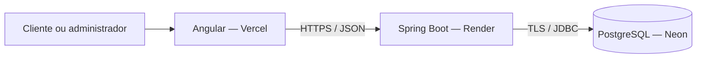

# Telemicro — API de orçamentos e painel administrativo

Plano inicial — 01/10/2026. Etapas 1, 2, 3 e 4 implementadas e verificadas; próximas etapas ainda planejadas.

## Objetivo

Transformar o formulário existente em um fluxo completo de solicitação e acompanhamento interno de orçamentos. Demonstrar desenvolvimento backend em Java/Spring Boot com PostgreSQL, integrado ao Angular. Publicar uma demonstração pessoal e apresentar à empresa antes de uma eventual adoção operacional.

O formulário atual envia ao Formspree. A aplicação atual usa Angular 20, componentes standalone, Reactive Forms e HttpClient. O backend será adicionado em `backend/`, mantendo o frontend na estrutura atual e compartilhando o mesmo repositório.

## Escopo da primeira versão

- Cliente informa nome, telefone, serviço e mensagem e recebe protocolo de confirmação.
- API valida e armazena a solicitação antes de confirmar o sucesso.
- Administrador entra com e-mail e senha, consulta pedidos e seus detalhes.
- Lista tem paginação, filtro de status/serviço e busca por nome ou protocolo.
- Administrador altera status e adiciona observações internas.
- Histórico registra quem alterou o status e quando.
- Demonstração publicada com dados fictícios e credenciais demonstrativas restritas.

Ficam para etapas futuras: consulta pública do andamento, e-mails automáticos, anexos, cadastro público de usuários, orçamento financeiro, estoque, pagamentos e ordens de serviço. A primeira versão não envia notificações reais.

## Stack proposta

| Camada | Escolha | Uso |
| --- | --- | --- |
| Frontend | Angular 20 e TypeScript existentes | Landing page, login e painel |
| Backend | Java 21 e Spring Boot 4.1.x | API REST; fixar patch estável na criação |
| Build | Maven Wrapper | Build reproduzível |
| HTTP | Spring MVC | Controllers e DTOs |
| Segurança | Spring Security, BCrypt, JWT validado por Resource Server | Login e autorização |
| Persistência | Spring Data JPA/Hibernate | Repositórios e transações |
| Banco | PostgreSQL 17 | Banco local e Neon; confirmar versão no provisionamento |
| Migrações | Flyway | Evolução explícita do schema; Hibernate em validate |
| Validação | Jakarta Bean Validation | Dados de entrada |
| Documentação | springdoc-openapi 3.x | OpenAPI e Swagger UI; conferir matriz de compatibilidade |
| Operação | Actuator e logs estruturados | Health e diagnóstico sem dados pessoais |
| Verificação | JUnit, Spring Boot Test e Testcontainers/PostgreSQL | Integração com banco real e autorização |
| Entrega | Docker, GitHub Actions | Imagem da API, build e verificações |

Evitar dependências sem necessidade. DTOs explícitos e organização por funcionalidade: `auth`, `budget`, `servicecatalog`, `shared` e `config`. Dentro de cada funcionalidade, controllers, services e repositories conforme necessários. Uma única API e um único banco.

## Arquitetura e ambientes

- Local: Angular em 4200, API em 8080 e PostgreSQL em Docker Compose. Conferir Java, Docker e ferramentas instaladas antes de iniciar.
- Demonstração: frontend Vercel Hobby, API Render Free via Docker e banco Neon Free. Usar domínios gratuitos dos provedores.
- Configuração: URL da API no frontend; credenciais do banco, chave JWT, CORS e modo demo no backend por variáveis de ambiente. Nunca incluir segredos no bundle Angular nem no Git.
- Banco: TLS no Neon, pool pequeno e timeout definido. Evitar tarefas periódicas que mantenham o banco ativo sem necessidade.
- CORS: liberar somente origens configuradas; evitar wildcard. Não liberar automaticamente qualquer preview da Vercel.
- Render: ajustar porta conforme `PORT`, memória da JVM e health check. A API gratuita pode levar cerca de um minuto para acordar; o timeout atual de 20 segundos do formulário precisa ser revisto.
- Migração: frontend compilado pode ser hospedado na HostGator. API Java e PostgreSQL exigem infraestrutura compatível, como VPS; hospedagem compartilhada da HostGator não os suporta. Também é possível mover somente o frontend e manter API/banco em outros provedores.

## Banco de dados

Datas em `timestamptz`, tratadas em UTC e exibidas no horário local. IDs UUID. Chaves estrangeiras, restrições NOT NULL e limites de campos no banco complementam a validação da API.

| Tabela | Campos principais |
| --- | --- |
| `admin_users` | id, email normalizado único, password_hash, role (ADMIN/DEMO), active, created_at |
| `service_types` | id, code único, name, active, display_order |
| `budget_requests` | id, protocol único, customer_name (100), phone (13), service_type_id, message (2000), status, version, is_demo, created_at, updated_at |
| `budget_status_history` | id, budget_request_id, previous_status, new_status, changed_by nullable, created_at |
| `budget_notes` | id, budget_request_id, author_id, text (2000), created_at |

O protocolo é uma referência pública de atendimento, não uma credencial de acesso. Sua geração deve tratar colisões. O ID interno não é usado para dar acesso público aos detalhes.

Índices iniciais: protocolo único, e-mail único, `(status, created_at)` e `(service_type_id, created_at)`, além das FKs das notas e histórico. Busca por nome inicialmente simples; índices adicionais somente após medir necessidade.

O catálogo terá os sete serviços atuais, cadastrados por migração. Serviços inativos deixam de aceitar novos pedidos e continuam associados aos antigos. Não criar CRUD de catálogo no MVP.

`version` permite controle otimista: duas alterações simultâneas não sobrescrevem silenciosamente o trabalho da equipe. Alteração de status e histórico são salvos na mesma transação.

## Regras de atendimento

Status: `NEW`, `IN_PROGRESS`, `COMPLETED`, `CANCELLED`.

- Novo pedido começa em NEW e registra o evento inicial, sem administrador associado.
- NEW pode ir para IN_PROGRESS ou CANCELLED.
- IN_PROGRESS pode ir para COMPLETED ou CANCELLED.
- COMPLETED e CANCELLED podem ser reabertos para IN_PROGRESS, com justificativa obrigatória registrada como observação interna na mesma transação.
- Repetir o status atual não cria evento novo.
- Validar nome sem espaços em branco, telefone com DDD normalizado, serviço ativo e tamanho da mensagem no servidor.
- Pedidos e histórico não são apagados pelo painel no MVP. Definir retenção e procedimento de exclusão antes de uso com clientes reais.
- Retentativas do formulário usam a mesma chave de idempotência por envio lógico. A implementação adicionará armazenamento dedicado da chave, hash do payload e resposta para impedir duplicatas após timeout; TTL proposto de 24 horas. Nova tentativa com payload diferente e mesma chave retorna conflito.

## Contrato inicial da API

Prefixo `/api/v1`. JSON com nomes em inglês no contrato; interface em português. Nunca serializar entidades JPA diretamente. Erros em ProblemDetail com mensagens e erros por campo, sem detalhes internos.

| Método e rota | Acesso | Resultado |
| --- | --- | --- |
| GET `/services` | Público | Serviços ativos |
| POST `/budgets` | Público | Cria pedido; 201 com protocolo e data, header Idempotency-Key |
| POST `/auth/login` | Público | Valida credenciais e devolve token curto |
| GET `/auth/me` | Autenticado | Identidade e papel |
| GET `/admin/budgets` | ADMIN/DEMO | Lista paginada e filtrada |
| GET `/admin/budgets/{id}` | ADMIN/DEMO | Detalhes, notas e histórico |
| PATCH `/admin/budgets/{id}/status` | ADMIN | Status, versão esperada e justificativa quando exigida |
| POST `/admin/budgets/{id}/notes` | ADMIN | Adiciona nota interna |
| GET `/admin/budgets/summary` | ADMIN/DEMO | Contagem por status usando os mesmos filtros aplicáveis |
| GET `/actuator/health` | Público, sem detalhes | Estado mínimo do serviço |

Paginação começa em zero, tamanho padrão 20, máximo 100; ordenação inicial por data decrescente e ID para desempate. Filtros de data, status, serviço e busca têm limites e whitelist de ordenação. Respostas: 400 para validação, 401 para autenticação, 403 para permissão, 404 para recurso inexistente, 409 para conflito e 429 para excesso de tentativas.

## Login e demonstração

- Sem cadastro público. Primeiro administrador criado por procedimento de bootstrap explícito com segredo de ambiente; sem senha padrão no código.
- JWT curto, proposta de 30 minutos, armazenado somente na memória do frontend. Ao recarregar ou expirar, pedir login novamente. Sem refresh token no MVP, reduzindo o escopo inicial.
- Logout limpa o token no cliente; token emitido continua válido até expirar. A API também confere se usuário permanece ativo. Documentar essa limitação; revogação imediata é evolução futura.
- Guard Angular melhora navegação; toda autorização real acontece na API.
- Papel DEMO é somente leitura e mostra exclusivamente dados fictícios. Um ambiente de demonstração não compartilha banco com operação real.
- Limitar tentativas de login e submissões por IP com política configurável; no MVP, limite em memória adequado à única instância, documentando reset ao reiniciar.
- Não registrar senhas, tokens, telefones ou mensagens nos logs. Swagger na demonstração/local; revisar exposição antes de operação real.
- Aviso de privacidade do formulário será atualizado ao substituir Formspree.

## Painel Angular

Rotas propostas: `/admin/login`, `/admin/orcamentos` e `/admin/orcamentos/:id`. Layout responsivo com tabela no desktop e cards no celular. Contadores por status, filtros, paginação, detalhes, histórico e notas. Sem biblioteca visual adicional inicialmente.

Serviços Angular centralizam chamadas HTTP. Interceptor inclui token apenas para a origem da API e trata sessão expirada. Exibir estados de carregamento, vazio, erro e conflito. O formulário preserva os dados em erro e timeout; limpar apenas após criação confirmada. Retentativas preservam a chave de idempotência. A confirmação pública não exibe informações internas.

## Roadmap

| Etapa | Entrega concreta | Critério de conclusão |
| --- | --- | --- |
| 1. Fundação | backend Spring, Wrapper, Compose, ambientes e Flyway | API inicia e schema é criado em PostgreSQL local |
| 2. Pedidos públicos | catálogo, validação, criação, protocolo e idempotência | Pedido válido persiste; inválido e duplicata são tratados |
| 3. Segurança e gestão | login, papéis, lista, filtros, status, notas e histórico | Rotas protegidas; conflitos e transições são tratados |
| 4. Integração e painel | formulário usa API e telas administrativas | Fluxo de envio, login e atendimento funciona de ponta a ponta |
| 5. Demonstração online | Docker Render, Neon, Vercel e dados fictícios | URLs acessíveis, cold start tratado e conta DEMO restrita |
| 6. Portfólio | README, diagrama, screenshots e exemplos da API | Outra pessoa consegue executar e compreender as decisões |

Executar em entregas pequenas. Primeiro completar criação e persistência de um orçamento local; depois login e painel. Estimar prazo após a etapa 1, considerando ambiente disponível e tempo dedicado pelo usuário.

## Verificação planejada

Testar regras de transição, validação, idempotência e concorrência. Integração com PostgreSQL via Testcontainers para persistência, migrações, filtros e autorização. Frontend: envio, erros, token expirado e papel demonstrativo. Conferência manual responsiva e do fluxo completo publicado, incluindo primeira requisição após suspensão da API. CI executa verificações e builds sem acessar banco de produção ou enviar notificações.

## Publicação e custos

O objetivo é demonstrar dentro das cotas gratuitas, sem contratar planos inicialmente. Render Free pode suspender por ociosidade e cotas; Neon Free também tem limites. Não prometer disponibilidade contínua. Conferir cotas e opções de cobrança nas contas ao provisionar.

Vercel Hobby permite uso pessoal/não comercial: publicar como demonstração de portfólio com dados fictícios. Adoção pela loja exige revisão de hospedagem e termos, além de backups, retenção dos dados e acesso administrativo. Para HostGator, confirmar o plano exato antes de prometer migração completa. Frontend na hospedagem existente e API/banco externos é alternativa válida.

## Referências

- [Spring Boot — requisitos](https://docs.spring.io/spring-boot/system-requirements.html)
- [springdoc — compatibilidade](https://springdoc.org/)
- [Render — plano gratuito](https://render.com/docs/free)
- [Neon — cotas do plano gratuito](https://github.com/neondatabase/website/blob/main/content/faqs/free-plan-limits-and-quotas.md)
- [Vercel — termos Hobby](https://vercel.com/legal/terms)
- [HostGator — compatibilidade](https://suporte.hostgator.com.br/hc/pt-br/articles/30811116692115-Quais-s%C3%A3o-as-compatibilidades-da-HostGator)

## Próxima ação

Implementar a etapa 5: Docker para a API, configuração de publicação Render/Vercel/Neon e pedidos fictícios com conta DEMO. Novas submissões públicas continuam privadas. A publicação depende do acesso às contas de hospedagem.

## Entrega da etapa 1 — 01/10/2026

- Backend criado em `backend/` com Spring Boot 4.1.1, target Java 21 e Maven Wrapper 3.9.16.
- PostgreSQL 17.9 via Compose, com volume persistente e porta local 55432, escolhida para evitar conflito com outros bancos existentes.
- Perfis e variáveis de ambiente configurados, com credenciais locais isoladas de configuração externa.
- V1 cria as cinco tabelas de negócio; V2 cadastra os sete serviços existentes. Nenhuma credencial administrativa é criada.
- Actuator expõe somente health, sem detalhes internos.
- `verify` passou: dois testes de integração com PostgreSQL real via Testcontainers, sem falhas ou testes ignorados. Build executado com o JDK 25 disponível, compilando para Java 21; execução no JDK 21 será conferida na etapa de imagem Docker.
- API local iniciou, aplicou ambas as migrações e respondeu `status: UP` em `/actuator/health`; catálogo local contém sete serviços.
- Instruções de execução e configuração registradas em `backend/README.md`. Formulário continua usando Formspree até a etapa de integração.

## Entrega da etapa 2 — 01/10/2026

- GET `/api/v1/services`: serviços ativos com código e nome, em ordem de exibição; entidade e repositório JPA validam o catálogo existente.
- POST `/api/v1/budgets`: JSON validado no servidor, telefone normalizado com prefixo 55, pedido NEW e evento inicial gravados em PostgreSQL.
- Resposta HTTP 201 contém somente protocolo e data. Erros em ProblemDetail, com mensagens por campo para validação e HTTP 409 para reutilização incompatível da chave.
- V3 adiciona `budget_idempotency` com hash do conteúdo normalizado, referência ao pedido e expiração de 24 horas. Mesma chave/conteúdo devolve a resposta original; chaves vencidas são removidas quando reutilizadas, sem limpeza periódica nesta etapa.
- Escrita usa JdbcTemplate na transação gerenciada pelo Spring/JPA para locks transacionais PostgreSQL e `ON CONFLICT`. Pedido, histórico e chave são atômicos; colisão de protocolo provoca nova geração em até cinco tentativas.
- Onze testes de integração passaram em PostgreSQL real: catálogo, validação, normalização, replay, conflito, expiração, requisições concorrentes e rollback forçado na gravação do histórico.
- JAR atualizado gerado com sucesso após parar a instância anterior que bloqueava o arquivo no Windows. API local reiniciada; health UP e catálogo com sete serviços confirmados.
- README contém contrato e exemplo PowerShell. Integração Angular permanece prevista para a etapa 4.

## Entrega da etapa 3 — 01/10/2026

- Spring Security Resource Server com JWT HS256: valida assinatura, expiração, issuer, audience e claims obrigatórios. Login emite token de 30 minutos; senhas BCrypt com custo 12. Sem refresh token nem sessão de servidor.
- Usuário ativo e papel atual consultados no PostgreSQL em cada requisição autenticada. Conta desativada perde acesso; papel alterado afeta permissões imediatamente. ADMIN escreve; DEMO é somente leitura e exige modo demo habilitado.
- V4 adiciona `is_demo`; filtro DEMO aplicado à listagem, detalhes e resumo. Pedidos privados retornam 404 para DEMO. Novas submissões públicas não são marcadas automaticamente como fictícias.
- Listagem paginada com status, serviço, busca literal por nome/protocolo, intervalo de data e ordenação permitida. Resumo compartilha os mesmos filtros. Detalhes incluem notas e histórico com autores e datas.
- Atualização valida transição e versão esperada; conflitos retornam 409. Reabrir pedido encerrado exige justificativa, salva como nota. Status, versão, histórico e motivo são gravados na mesma transação. Repetir status atual com versão correta não altera o histórico.
- Notas internas validadas, somente inclusão. Não há exclusão de pedidos/histórico.
- Limites independentes em memória por IP: 10 logins e 20 submissões por 15 minutos, com 429/Retry-After e capacidade limitada. Proxy forwarding permanece desabilitado; conferir IP real e confiança no proxy na publicação.
- CORS somente para origens explícitas; local permite Angular em 4200. Wildcards recusados. Rotas não autorizadas bloqueadas por padrão; respostas privadas usam no-store.
- Bootstrap explícito e transacional do primeiro ADMIN, com opção DEMO quando habilitada, sem redefinir credenciais existentes. Scripts locais geram chave/senha aleatórias em `.env.local` ignorado pelo Git; configuração externa exige chave Base64 de pelo menos 32 bytes.
- 31 testes passaram, incluindo tokens adulterados/vencidos, issuer/audience, conta inativa, mudança de papel, DEMO desabilitado, isolamento de novas submissões, concorrência, rollback, CORS, rate limit e bootstrap.
- Build concluído e API local reiniciada. Health UP, login/me ADMIN, listagem autenticada e 401 para acesso anônimo confirmados. Primeiro administrador local criado; bootstrap desativado após confirmação. Senha disponível somente no arquivo local ignorado pelo Git.
- Limitações documentadas: logout remove token no cliente, sem revogação individual imediata; limites reiniciam com o processo e não são compartilhados entre instâncias. Frontend permanece para a etapa 4.

## Entrega da etapa 4 — 01/10/2026

- Formulário usa catálogo da API, JSON e Idempotency-Key reutilizada após falha; confirma protocolo e preserva dados em erros. Prazo de 90 segundos para inicialização da hospedagem gratuita.
- Login e painel Angular com JWT somente em memória, guard e interceptor limitado aos endpoints protegidos. Sessão expirada retorna ao login; rotas carregadas sob demanda.
- Painel responsivo com filtros, resumo, paginação, histórico, observações e transições de status. Reabertura exige motivo; conflito de versão recarrega detalhes preservando o texto. Conta DEMO somente de leitura.
- Proxy local conecta Angular na porta 4200 à API na porta 8080; instruções e limites da configuração de publicação no README.
- Frontend: 14 testes passaram no ChromeHeadless e build de produção passou. Nenhum pedido real criado pelos testes.

